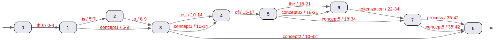

# AnnotateFilter

**A Lucene TokenFilter that adds annotations**

As Mike Mccandles describes in his <a href="https://blog.mikemccandless.com/2012/04/lucenes-tokenstreams-are-actually.html">blog</a>: Lucene TokenStreams are actually graphs!

Inspired by this, we present AnnotateFilter, a TokenFilter that makes it possible to add annotation to a TokenStream. By annotations we mean terms that have a start and end offset in the text that was the source of the TokenStream.

For instance, if we know that "concept1" is mentioned at characters 5 to 9 in the original text, we can add the term "concept1" in the TokenStream, referring to opsition 5 to 9 in the original text. This term is added to the TokenStream, where in this case are two terms already: "is" and "a". "concept1" does not replace these terms. The term is added to the normally linear TokenStream, making it a graph. A directed graph actually. Because "concept1" is simply a term, we can search for it just as we search for other terms.

The annotations carry the from and to offset in the original text. The only thing the AnnotateFilter does is matching these ofsets with a given TokenStream: given a list of annotations and a tokenstream, the annotations are matched and added to the TokenStream.

The TokenFilter is an iterator: a token is pulled by an upstream process and the TokenFilter pulls a token from a downstream process. This makes a lookahead more cumbersome. We started with the code of a TokenFilter that also does matching with lookaheads: Lucene's SynonymGraphFilter. We kept the lookahead structure of this filter, with several buffers, removed the synonym FST matching logic and added our own matching logic. This is in a sense more easy: synonyms can consist of multiple terms, annotations only consist of a single term. It is also more complicated: different annotations can start at the same term and an annotation can span beyond the start of another annotation.

## How does the matching work?

## How can it be used?

- Highlights

- PositionLength encoded in the payload and decoded in a query module

## Further work

## test command

mvn clean compile exec:java -Dexec.mainClass="main.java.nl.structs.TokenizeTest"
